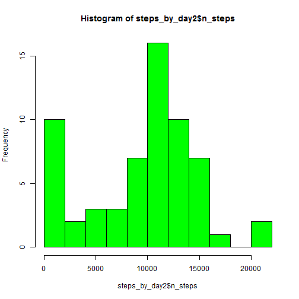

#Reproducible Research Assignment 1
  
##Introduction

It is now possible to collect a large amount of data about personal movement using activity monitoring devices
such as a Fitbit, Nike Fuelband, or Jawbone Up.  
These type of devices are part of the "quantified self" movement - a group of enthusiasts who take 
measurements about themselves regularly to improve their health, to find patterns in their behavior, 
or because they are tech geeks.  
But these data remain under-utilized both because the raw data are hard to obtain and there is a lack of statistical methods and software for processing and interpreting the data.  
  
This assignment makes use of data from a personal activity monitoring device. This device collects data at 5 minute intervals through out the day. The data consists of two months of data from an anonymous individual collected during the months of October and November, 2012 and include the number of steps taken in 5 minute intervals each day.

##Data

The data for this assignment can be downloaded from the course web site:  
- Dataset: Activity monitoring data [52K]  
  
The variables included in this dataset are:  
  
- steps: Number of steps taking in a 5-minute interval (missing values are coded as NA)  
- date: The date on which the measurement was taken in YYYY-MM-DD format  
- interval: Identifier for the 5-minute interval in which measurement was taken  
  
The dataset is stored in a comma-separated-value (CSV) file and there are a total of 17,568 observations in this dataset.  
  
##Assignment  
  
This assignment will be described in multiple parts.  
You will need to write a report that answers the questions detailed below.  
Ultimately, you will need to complete the entire assignment in a single R markdown document that can be processed by knitr and be transformed into an HTML file.  
  
Throughout your report make sure you always include the code that you used to generate the output you present.   When writing code chunks in the R markdown document, always use echo = TRUE so that someone else will be able to read the code.   This assignment will be evaluated via peer assessment so it is essential that your peer evaluators be able to review the code for your analysis.  
  
For the plotting aspects of this assignment, feel free to use any plotting system in R (i.e., base, lattice, ggplot2)  
  
Fork/clone the GitHub repository created for this assignment.  
You will submit this assignment by pushing your completed files into your forked repository on GitHub.  
The assignment submission will consist of the URL to your GitHub repository and the SHA-1 commit ID for your repository state.  
NOTE: The GitHub repository also contains the dataset for the assignment so you do not have to download the data separately.  

##(0) Load packages  
    
First, we will load the packages we need throughout this assignment.  
  

```r
library(dplyr)
library(lubridate)
library(ggplot2)
```
  
##(1) Loading and preprocessing the data

Show any code that is needed to  
1. Load the data (i.e. read.csv())  
2. Process/transform the data (if necessary) into a format suitable for your analysis  
  

```r
data <- read.table(unz("repdata_data_activity.zip", "activity.csv"), header=T, quote="\"", sep=",")
data$date <- as.Date(data$date, "%Y-%m-%d")
summary(data)
```

```
##      steps             date               interval     
##  Min.   :  0.00   Min.   :2012-10-01   Min.   :   0.0  
##  1st Qu.:  0.00   1st Qu.:2012-10-16   1st Qu.: 588.8  
##  Median :  0.00   Median :2012-10-31   Median :1177.5  
##  Mean   : 37.38   Mean   :2012-10-31   Mean   :1177.5  
##  3rd Qu.: 12.00   3rd Qu.:2012-11-15   3rd Qu.:1766.2  
##  Max.   :806.00   Max.   :2012-11-30   Max.   :2355.0  
##  NA's   :2304
```

```r
str(data)
```

```
## 'data.frame':	17568 obs. of  3 variables:
##  $ steps   : int  NA NA NA NA NA NA NA NA NA NA ...
##  $ date    : Date, format: "2012-10-01" "2012-10-01" ...
##  $ interval: int  0 5 10 15 20 25 30 35 40 45 ...
```
    

##(2) What is mean total number of steps taken per day?  
  
For this part of the assignment, you can ignore the missing values in the dataset.  
  
1. Calculate the total number of steps taken per day  
2. If you do not understand the difference between a histogram and a barplot,   
        research the difference between them.  
        Make a histogram of the total number of steps taken each day  
3. Calculate and report the mean and median of the total number of steps taken per day  

The number of breaks in the histogram is based upon the Freedman-Diaconis rule 
which is very robust and works well in practice.   


```r
#data_tbl <- tbl_df(data)
#data_tbl_notna <- filter(data_tbl,!is.na(steps))
#data_tbl_grouped <- group_by(data_tbl_notna,date)
#steps_by_day <- summarize(data_tbl_grouped, n_steps = sum(steps))

steps_by_day <- data %>% tbl_df %>% filter(!is.na(steps)) %>% group_by(date) %>% summarize(n_steps = sum(steps))
hist(steps_by_day$n_steps, col="gold", breaks="FD")
```

 


```r
mean_steps_per_day <- as.integer(round(mean(steps_by_day$n_steps), digits=0))
median_steps_per_day <- median(steps_by_day$n_steps)
```

The mean of the total number of steps taken per day is 10766.  
The median of the total number of steps taken per day is 10765.  

##(3) What is the average daily activity pattern?  
  
1. Make a time series plot (i.e. type = "l") of the 5-minute interval (x-axis) and the average number of steps taken, averaged across all days (y-axis)  

2.Which 5-minute interval, on average across all the days in the dataset, contains the maximum number of steps?  
  
More info can be found at http://www.statmethods.net/advstats/timeseries.html  
  

```r
# subset the time series (during the months of October and November, 2012)
data_tbl_notna <- filter(tbl_df(data),!is.na(steps))
summary <- aggregate(data_tbl_notna$steps, list(interval = data_tbl_notna$interval), mean)
plot(summary$interval,summary$x, type = "l")
```

 

```r
max_steps <- max(summary$x)
max_stepstime <- as.integer(subset(summary,summary$x==max_steps)$interval)
```

The 5 minute interval 835 is the one which on average across all the days in the dataset, contains the maximum number of steps.  

##(4) Imputing missing values  
  
Note that there are a number of days/intervals where there are missing values (coded as NA). The presence of missing days may introduce bias into some calculations or summaries of the data.  

1.Calculate and report the total number of missing values in the dataset (i.e. the total number of rows with NAs)  
2.Devise a strategy for filling in all of the missing values in the dataset. The strategy does not need to be sophisticated. For example, you could use the mean/median for that day, or the mean for that 5-minute interval, etc.  
3.Create a new dataset that is equal to the original dataset but with the missing data filled in.  
4.Make a histogram of the total number of steps taken each day and Calculate and report the mean and median total number of steps taken per day. Do these values differ from the estimates from the first part of the assignment? What is the impact of imputing missing data on the estimates of the total daily number of steps?  


```r
# (1) number of missing values
data_missing <- data[!complete.cases(data),]
n_na <- as.integer(nrow(data_missing))
n_na_steps <- as.integer(sum(is.na(data_missing$steps)))
n_na_date <- as.integer(sum(is.na(data_missing$date)))
n_na_interval <- as.integer(sum(is.na(data_missing$interval)))

# (2) calculate average number of steps by interval
newdata <- na.omit(data)
newdata_tbl <- tbl_df(data)
newdata_tbl_grouped <- group_by(newdata,interval)
steps_by_interval <- summarize(newdata_tbl_grouped, n_steps = median(steps))

# (3) create new dataset without missing data 
totaldata <- merge(data,steps_by_interval,by="interval")     
totaldata$steps2 <- ifelse(is.na(totaldata$steps),totaldata$n_steps,totaldata$steps)
keeps <- c("steps2","date","interval")
data2 <- totaldata[keeps]
nrow(data2[!complete.cases(data2),])
```

```
## [1] 0
```

```r
# (4) histogram
data2_tbl <- tbl_df(data2)
data2_tbl_grouped <- group_by(data2_tbl,date)
steps_by_day2 <- summarize(data2_tbl_grouped, n_steps = sum(steps2))

#hist(steps_by_day2$n_steps, col="green", breaks="FD")
hist(steps_by_day2$n_steps, col="green", breaks=10)
```

 

```r
mean_steps_per_day2 <- as.integer(round(mean(steps_by_day2$n_steps), digits=0))
median_steps_per_day2 <- median(steps_by_day2$n_steps)

values0_before_imputing <- as.integer(nrow(subset(data,steps == 0)))
values0_after_imputing <- as.integer(nrow(subset(data2,steps2 == 0)))
```

The total number of missing values in the dataset is equal to 2304.  
There are 2304/0/0 missing values for the variables steps, date and interval.
  
By imputing the missing values by the median of all values for the corresponding 5-minute interval, many missing values are now replaced by a value of 0.  
0-values in the dataset increases from 11014 to 12894.  
  
After imputing the missing values:  
The mean of the total number of steps taken per day decreases from 10766 to 
9504.  
The median of the total number of steps taken per day decreases from 10765 to
10395.  
  
   
##(5) Are there differences in activity patterns between weekdays and weekends?

For this part the weekdays() function may be of some help here.  
Use the dataset with the filled-in missing values for this part.  

1.Create a new factor variable in the dataset with two levels - "weekday" and "weekend" indicating whether a given date is a weekday or weekend day.  
2.Make a panel plot containing a time series plot (i.e. type = "l") of the 5-minute interval (x-axis) and the average number of steps taken, averaged across all weekday days or weekend days (y-axis). See the README file in the GitHub repository to see an example of what this plot should look like using simulated data.
  

```r
#data2$weekday <- weekdays(data2$date)
#data2$weekdaynr <- wday(data2$date)
data2$daytype <- ifelse(wday(data2$date) == 7 | wday(data2$date) == 1, "weekend", "weekday")
data2$daytype_fac = factor(data2$daytype,levels=c("weekend","weekday"))
levels(data2$daytype_fac)
```

```
## [1] "weekend" "weekday"
```


```r
paneldata_tbl_grouped <- group_by(data2,daytype_fac,interval)
panelsteps_by_interval <- summarize(paneldata_tbl_grouped, avg_steps = mean(steps2))

qplot(interval, avg_steps, data=panelsteps_by_interval, facets = daytype_fac ~., geom = "line")
```

 
